# 1、骨骼与权重

## 1、骨骼的原理

在了解骨骼的原理之前，先介绍一下骨骼的父级这个概念。当我把一个子物体B附加给物体A，那么A就是B的父级。当我拖动A的时候，A的变换也会影响B，意思就是，A在xyz轴变动的大小同样施加给B。但是当我拖动B的时候，由于B是子级，其变换不会传递给A，因此A不会受到B的任何影响。

骨骼能够控制网格体的变化，其本质也就是网格体作为骨骼的子级，当骨骼变换时，其变换会传递给网格体。

一个网格体可以被多个网格体控制，骨骼对网格体的影响大小可以通过变换的系数来表示，当变换系数为1时，骨骼的变换可以全部传递给网格体，当变换系数小于1的时候，变换会有所折损，看起来就像骨骼对网格体的影响力没那么大了。

## 2、网格体和骨骼绑定发生了什么？

在物体模式下，我可以选择一个网格体，也可以多选多个网格体，然后在加选一个骨骼，按下ctrl+P，就会出现如下选项。

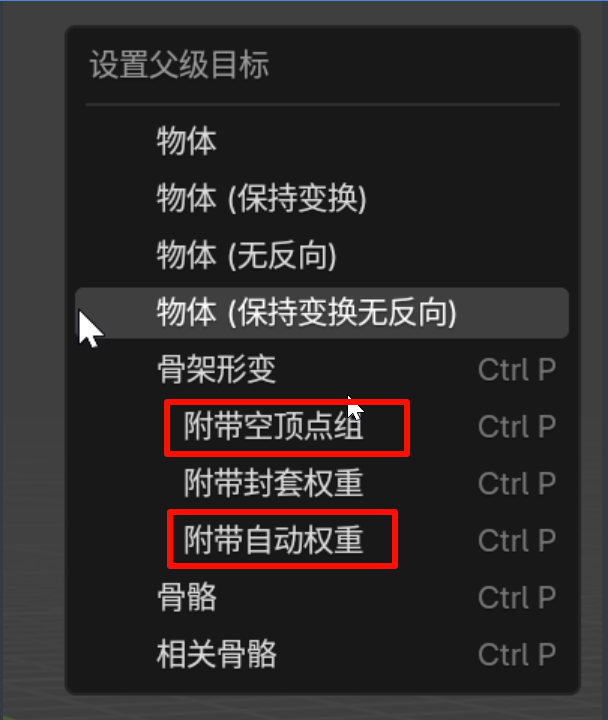

可以看出，绑定的过程就是设置父级，这个和骨骼的原理非常符合，易于理解。其中最常用的就是**附带空顶点组**和**附带自动权重**，如果你选第一个，那么就是你要决定自己刷权重，如果你选择第二个，那么你就是想让系统自动给你生成权重。

不管选择哪一个，大纲视图都会发生巨大变化，原来的网格体背移动到骨架的层级之下，如果你一开始是将多个网格体和骨骼绑定的，那么这么几个网格体就都处于骨架层级之下，且网格体之间是相同层级。

网格体下面也多了两个东西，分别是一个修改器和一个顶点组。

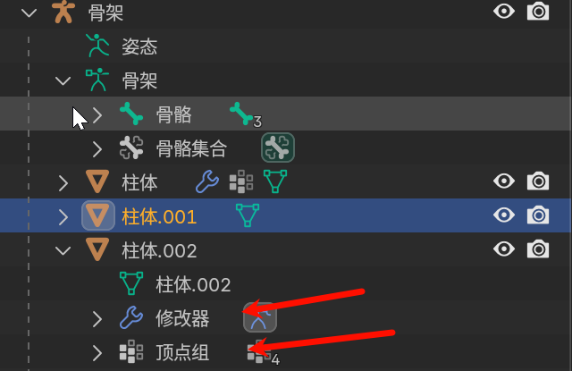

修改器的作用估计就是获取骨骼的变换，然后将其变换传递给网格体，对网格体进行修改。很明显，不可或缺。

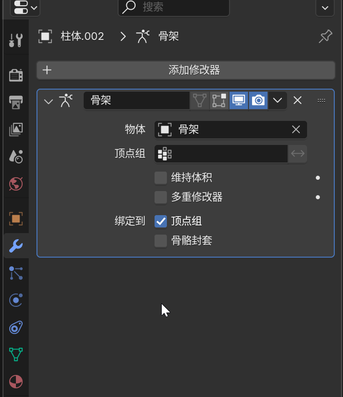

那么，顶点组是什么？看其细节信息如下。

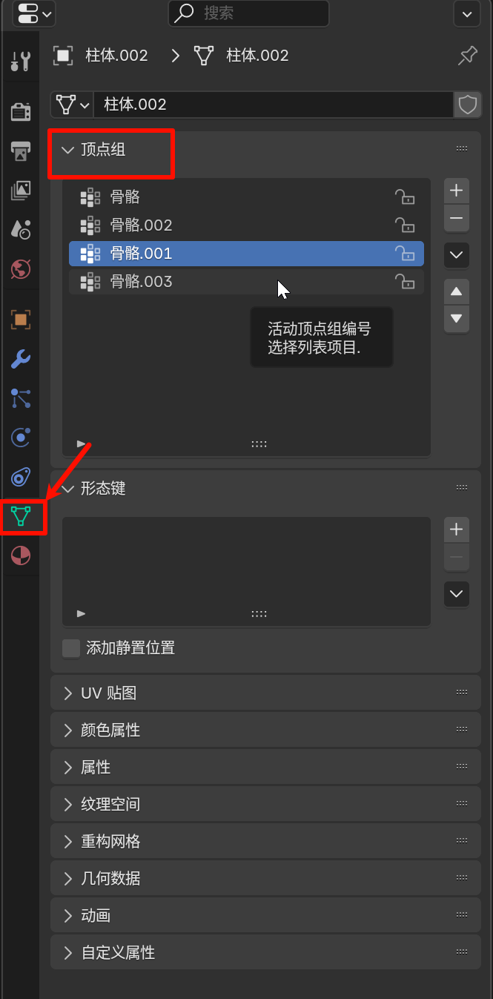

可以看出，顶点组和很多骨骼是重名的。顶点组简单来说，就是网格体的父级骨骼的名单，其通过记录骨骼的名字，就知道哪些骨骼的变换会对网格体产生影响，其影响是0到1之间的数，在这份名单之外的骨骼则完全不会对网格体产生任何影响。可以通过增删顶点组控制骨骼的影响范围或者网格体的上司范围。

当我删除这两个东西怎么样？首先肯定出问题，这个新的骨骼网格体会出Bug。其次，网格体仍然在骨架的子级，也可以手动再加回来。

**注意：勾选网格体，你才能查看、编辑顶点组，以及添加修改器**

## 3、骨骼的绑定

在将一个或者多个网格体附加到一个骨架之后，可以选择指定的方式或者刷权重的方式进行骨骼绑定。

### 1、指定

将一个或者多个网格体附加到一个骨架（附加空顶点组），物体模式选择一个网格体，进入编辑模式，转变为点模式，选择所有点，然后在顶点组选项里面，选中一个骨骼，然后点击指定，那么这样效果就是，该骨骼会对该网格体百分之一百的控制。

### 2、权重绘制

**在物体模式下**，选择你要绘制的网格体，然后Tab，选择权重绘制，对你没有勾选的网格体绘制是没有效果的，注意以下5个步骤即可。

在数据一栏中，选择对应的定点组就是选择对应的骨骼，然后再刷权重，千万别选错顶点组。

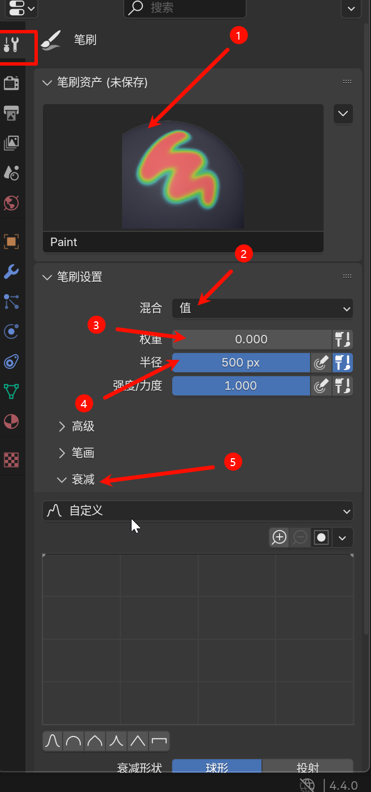

其中步骤3里面，常用的是**相加**和**值**，值就是赋值，笔刷选了什么颜色，刷上去就什么颜色。

# 解决物理资产骨骼背异常放大的问题

## 参考如下：

当你创建在UE中创建 Physical Asset时，你可能会遇到如下报错

The bone size is to small to create Physics Asset

或者勉强能创建物理资产，但是碰撞盒相比于模型却奇大无比

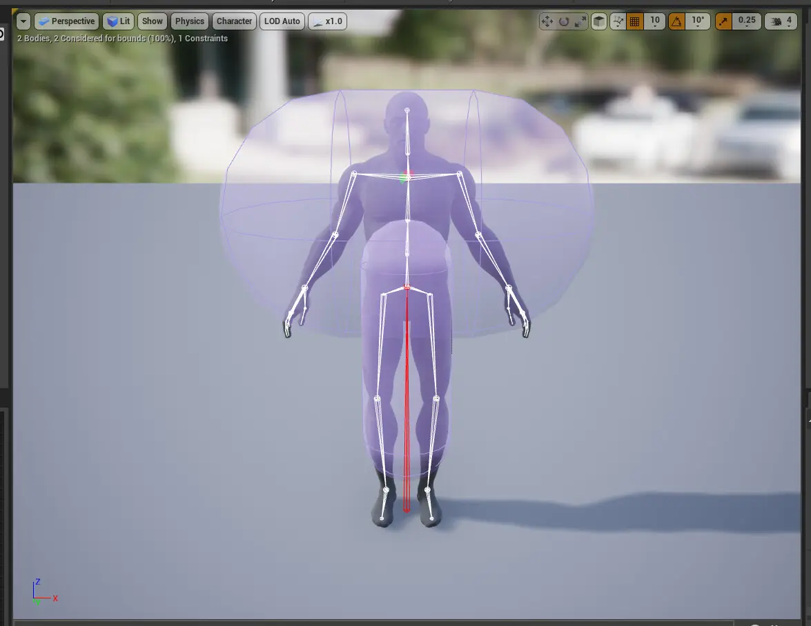

调整约束的时候，坐标轴和旋转中心不重合

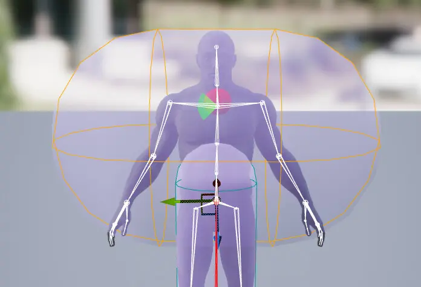

要是敢稍微挪动一下旋转中心，整个模型就飞了

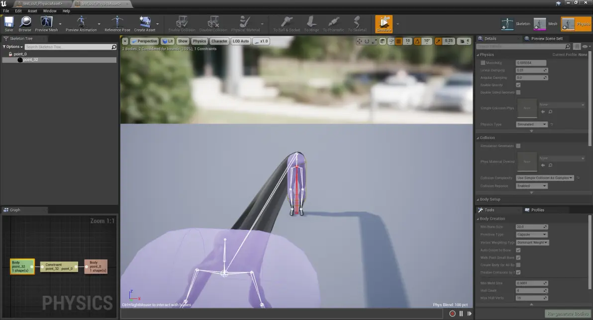

以上情况，想必是个人都会头疼不已，血压升高。但是不用担心，这是一个已知的bug，不管模型来自什么软件，导入到Unreal中，都有人出现了这个症状。

如果你的模型来自Blender，有人提出了解决方法

https://developer.blender.org/T47043#366967

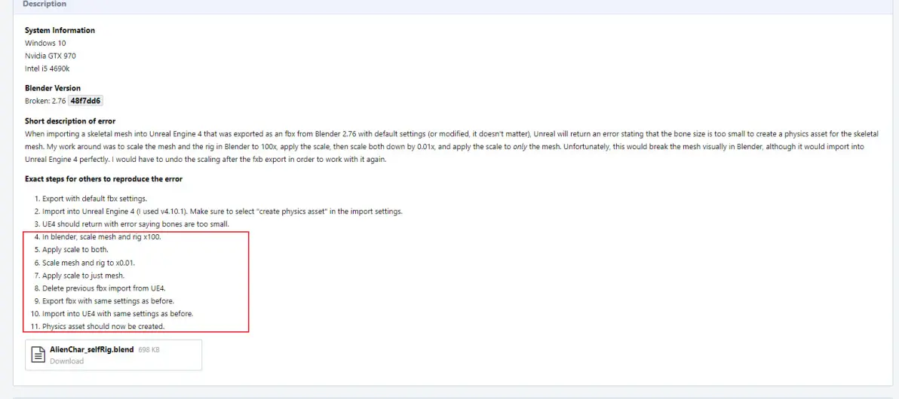

同时，还有人给出了更详细的图文介绍，他使用的方法和上述略有差异。但是也能达到同样的效果。

https://www.cnblogs.com/yaoling1997/p/16270186.html

文章的作者指出，他的做法来自于这个视频。

https://www.youtube.com/watch?v=jzUyS9ZP9Qg

这是一个长达20分钟的视频，应该有不少干货或许值得一看（我还没来得及看）

如果你出问题的模型导入自3dmax，也有人给出了一些说法：

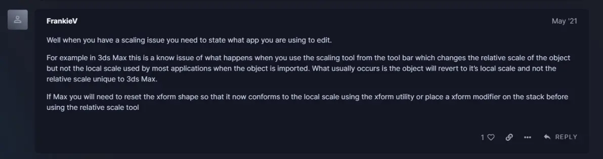

我遇到这个问题的时候，我是用的Houdini。我使用了如下办法解决：

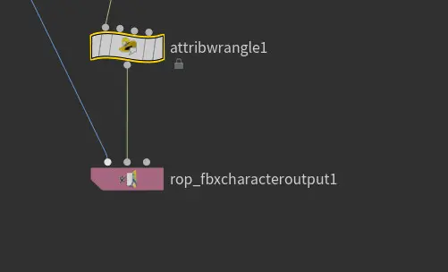

在将骨骼输入给导出结点之前执行一行脚本

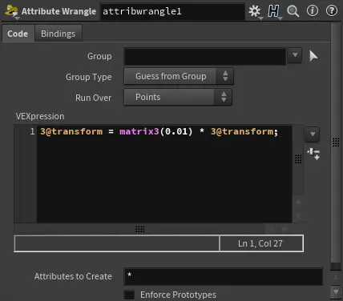

将所有骨骼上的矩阵乘0.01。问题就解决了。

最后，也是最重要的，

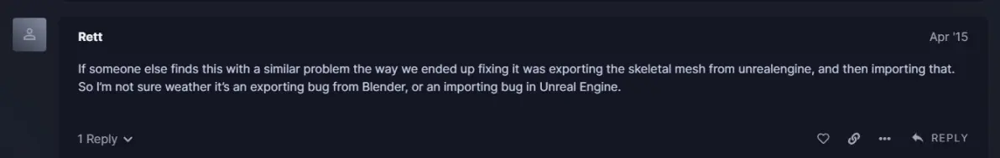

有人指出，只要将模型从UE导出，然后再重新导入，这个问题就会被修复。

真希望Epic能出一个LTS版本的Unreal，比起最新的Unreal，我更希望有一个解决了已知BUG的Unreal。

## 解决方法

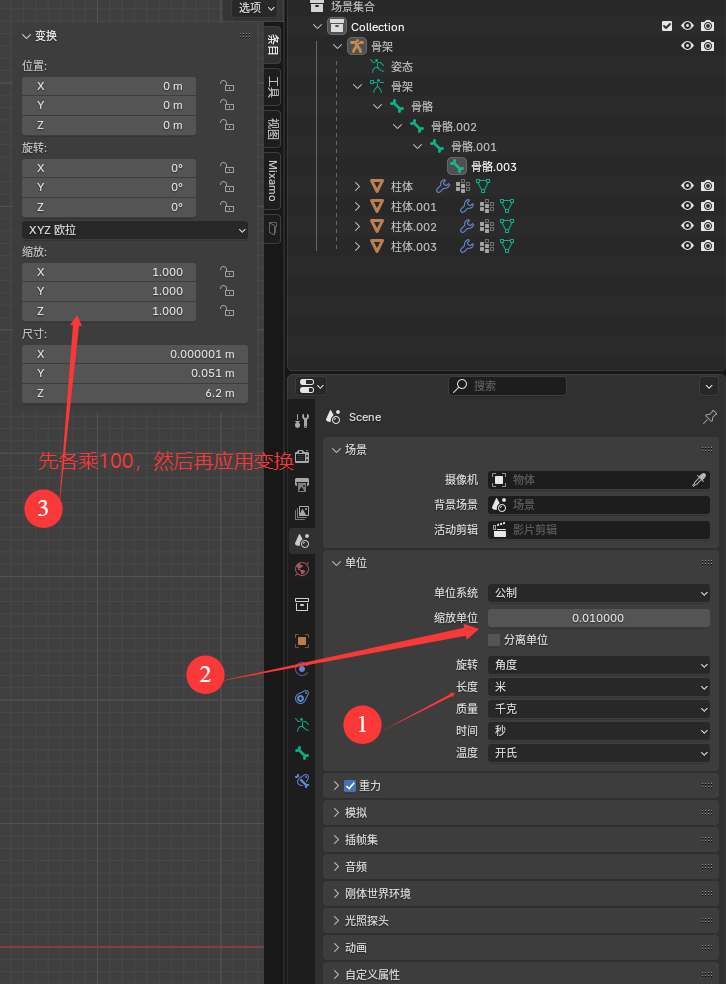

导出是，缩放为默认，导入时也还是默认。

