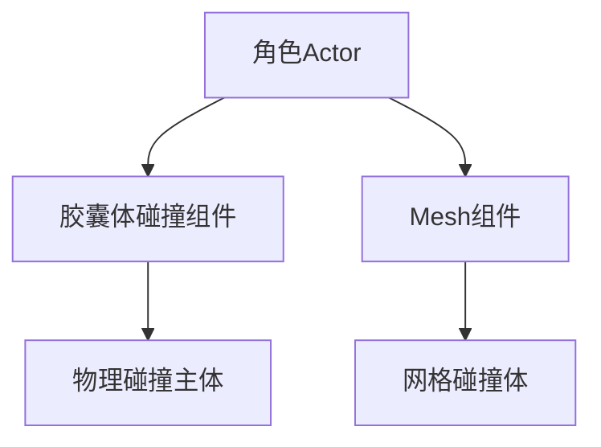
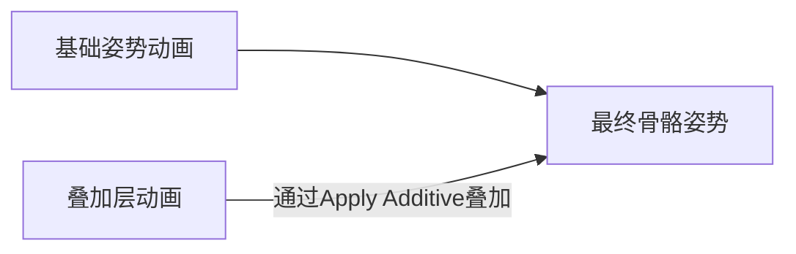

# VS头文件包含错误

VS里面，项目 -> 属性 -> VC++ 目录 -> 包含目录，然后添加头文件所在的路径

**注意：项目头文件路径会自动包含source文件夹，source文件夹下面可以新建文件夹，放自己的头文件和cpp文件，最好不要新建文件夹在你的项目文件夹下面（和private、public同级)，会出现各种头文件包含问题**

**注意2：方法没错，但是按照正常情况，不会出现这个问题**

# UE缺乏你的项目模块，需要手动重建？

VS代码无法编译，编译失败就无法进入UE，修改代码之后没有bug就能进入了

# 项目文件哪些可以删？

.vs、binary、DerivedDataCache、Intermediate、Saved、.vsconfig

# 在VS里面编辑完成如何热重载？

**情况一：没有打开UE**

直接快捷键`ctrl+F5`，程序会自动执行项目整体保存和编译的工作，并且之后会打开对应的UE项目。

**情况二：打开了UE**

`ctrl+S`或者`ctrl+shift+S`保存文件，不要编译，然后在UE里面，`ctrl+alt+F11`进行热重载，然后快捷键`alt+P`进行PIE（play in editor）测试。

**注意：如果需要对VS项目整体编译，必须要关闭UE，不然一定会编译错误**

**注意2：如果在UE打开的情况下，还进行编译，导致出错，又按了热重载，解决方法是，关闭UE，对VS项目整体编译，然后快捷键`ctrl+F5`打开UE**

**注意3：如果编译失败，可以`ctrl+B`和`ctrl+shift+B`多编译几次，如果还失败，那么就是代码问题**

# VS项目文件和真实项目文件的关联

VS项目文件和真实项目文件，两者的核心区别就是VS内部的项目文件管理器能够有选择性地展示真实文件管理器中的文件，当我把文件和文件夹从VS内部的项目文件管理器删除之后，该被删除的文件本质上叫被移除，在真实的文件管理器中并没有被删除，只是不在VS内部的项目文件管理器展示了。

VS编译时候的C头文件包含路径有source文件夹，我在source里面新建文件夹，在这个新文件夹里面加入自己的头文件和cpp文件，编译时候会找到这个文件，也不会在VS里面出现头文件找不到的情况。但是当我删除项目里面的VS因素，再进行VS项目重构，得到新的VS项目，这个时候，在VS内部的项目文件管理器里面就找不到我的自定义文件了，或者我在UE里面选择刷新我的C++项目，也会导致VS内部的文件资源管理器丢失我的自定义文件，但是此时编译仍然不会出错，也能正常热重载，问题就只有看不见。这个可以通过VS内部的项目文件管理器添加现有项来解决，有个小问题是只能看到文件却看不到父文件夹，问题不大。

所以说问题很小，但是也不能有事没事重构VS项目，或者刷新。

**注意：最好确保VS内部的项目文件管理器和真实的文件管理器文件和文件夹结构保持一致**

**注意2：文件还是最好不要放在source/项目名以外的文件夹，我发现正常也不会放在source/项目名以外的文件夹，不然重建后还需要导入|毛2025年6月5日**

# 如何解决帧率对速度的影响？

首先，需求就是，无论帧率如何速度不变，那么及时单位时间移动的距离不变。在UE中，世界随着tick也就是每一帧进行更新，而我在一帧中移动的距离是可以改变的，每一帧移动的距离相当于速度，故$物体每秒钟移动的距离=K=帧率*每帧距离=\frac{1秒}{deltaTime}*每帧距离$，所以推出，$每帧距离=K*deltaTime$。

 对于旋转也是一样，$每帧角度=K*deltaTime$。

# 欧拉角P角90度的时候出现死锁？

欧拉角本身特性导致的bug，解决方法是用四元数替代欧拉角，或者旋转的时候多加一个判断，箱子旋转范围。

# C++创建的变量暴露给蓝图，但是在蓝图的变量一栏找不到？

在这个右上角设置，勾选显示继承的变量。


# 蓝图里面找不到细节面板？

在这里点击BP_Item即可正常看见细节面板。


# VS代码没错误，为什么VS编译一直报错？

看看UE关没关。VS编译的时候确保UE是关闭的。

**注意：`generated.h`文件一定是要在头文件最后包含**

# 如何重构项目？

删除这些内容**.vs、binary、DerivedDataCache、Intermediate、Saved、.vsconfig、.sln**

接着UE的uproject文件右击，重构vs项目，这个时候直接进UE可能会报错。


这是因为UE的c++项目有Bug，编译不成功进不去UE，先进C++项目，改完bug，之后再进UE。

# 怎么删除UE里面不使用的类？

删除对应的文件和文件夹，可以重构c++项目，UE里面是不能直接删的，删完对应的文件和文件夹也不行，最主要的是Binery文件夹里面有中间文件，让UE误以为这个类还存在。

# 点击蓝图中的组件，细节面板空白，但是代码完全没错，怎么办？

我在一个自定义pawn类里面，这样写。

```cpp
//头文件
UPROPERTY(VisibleAnywhere, BlueprintReadWrite, Category = "MyMeshes")
UCapsuleComponent* P_Capsule; //胶囊碰撞体组件
UPROPERTY(VisibleAnywhere, BlueprintReadWrite, Category = "MyMeshes")
USkeletalMeshComponent* P_BirdMesh;

//cpp文件
P_Capsule = CreateDefaultSubobject<UCapsuleComponent>(TEXT("P_Capsule"));
P_Capsule->InitCapsuleSize(42.f, 96.0f);
SetRootComponent(P_Capsule);
P_BirdMesh = CreateDefaultSubobject<USkeletalMeshComponent>(TEXT("BirdMesh"));
P_BirdMesh->SetupAttachment(GetRootComponent());
```

结果这个鸟的细节面板就空白了,如下。


解决方法，改名字，别叫P_BirdMesh了。

# 重叠事件，发生重叠时胶囊体和mesh各触发一次，结束重叠时，胶囊体却触发两次？

您描述的问题——进入重叠时触发两次（Mesh和胶囊体各一次），而离开重叠时胶囊体触发两次——是虚幻引擎碰撞系统中一个非常典型的"双重触发"问题。让我详细解释原因并提供解决方案：

### 问题根源分析

#### 1. **碰撞层级关系（核心原因）**



- **胶囊体** 通常是角色的**主碰撞体**（RootComponent）
- **Mesh组件** 有自己的**网格碰撞体**
- 当其他物体靠近时，两个碰撞体都会检测到重叠

#### 2. **事件传播机制**

虚幻引擎的碰撞事件传播顺序：

1. 最具体的组件先触发（Mesh）
2. 然后父级组件触发（胶囊体）
3. 最后Actor级别事件触发

#### 3. **离开事件的特殊性**

离开事件触发两次的原因：

- 当物体离开时，引擎会检测**所有重叠关系的变化**
- 如果Mesh和胶囊体**同时结束重叠**，但被视为两个独立事件
- 引擎有时会错误地将一个离开事件**分发给两个组件**

### 解决方案

#### 方案1：统一碰撞处理（推荐）

```cpp
// 在角色构造函数中
PrimaryActorTick.bCanEverTick = true;

// 禁用Mesh的碰撞
GetMesh()->SetCollisionEnabled(ECollisionEnabled::NoCollision);
GetMesh()->SetGenerateOverlapEvents(false);

// 仅使用胶囊体检测
UCapsuleComponent* Capsule = GetCapsuleComponent();
Capsule->SetCollisionResponseToAllChannels(ECR_Overlap);
Capsule->OnComponentBeginOverlap.AddDynamic(this, &AMyCharacter::HandleOverlap);
Capsule->OnComponentEndOverlap.AddDynamic(this, &AMyCharacter::HandleEndOverlap);
```

#### 方案2：事件过滤

```cpp
void AMyCharacter::HandleEndOverlap(UPrimitiveComponent* OverlappedComp, 
                                    AActor* OtherActor,
                                    UPrimitiveComponent* OtherComp,
                                    int32 OtherBodyIndex)
{
    // 只处理胶囊体的事件
    if(OverlappedComp == GetCapsuleComponent())
    {
        // 真正的离开处理逻辑
        UE_LOG(LogTemp, Warning, TEXT("Valid EndOverlap"));
    }
}
```

#### 方案3：碰撞通道优化

```cpp
// 为Mesh设置特殊碰撞通道
GetMesh()->SetCollisionObjectType(ECC_PhysicsBody);
GetMesh()->SetCollisionResponseToChannel(ECC_Pawn, ECR_Ignore);

// 在重叠函数中过滤
void HandleOverlap(...)
{
    if(OtherComp->GetCollisionObjectType() != ECC_PhysicsBody)
    {
        // 只处理非Mesh的碰撞
    }
}
```

### 高级调试技巧

#### 1. 可视化碰撞关系

```bash
# 控制台命令
Collision.DrawOverlapEvents 1
ShowCollision
```

#### 2. 详细事件日志

```cpp
void HandleEndOverlap(...)
{
    FString OverlappedName = OverlappedComp->GetName();
    FString OtherName = OtherComp ? OtherComp->GetName() : "Null";
    
    UE_LOG(LogCollision, Warning, TEXT("EndOverlap: %s <-> %s"), 
        *OverlappedName, *OtherName);
}
```

#### 3. 碰撞关系分析工具

```cpp
// 检查当前重叠状态
TArray<AActor*> OverlappingActors;
GetCapsuleComponent()->GetOverlappingActors(OverlappingActors);

// 检查Mesh重叠状态
TArray<AActor*> MeshOverlapping;
GetMesh()->GetOverlappingActors(MeshOverlapping);
```

### 根本原因总结表

|         现象         |         原因         |        解决方案        |
| :------------------: | :------------------: | :--------------------: |
|    进入时两次触发    | Mesh和胶囊体都被检测 | 禁用Mesh碰撞或过滤事件 |
| 离开时胶囊体两次触发 |   事件传播机制错误   |    使用组件指针过滤    |
|    离开事件不一致    | 碰撞结束检测逻辑差异 |   统一使用一个碰撞体   |

# 跳跃动作异常，突然变小至消失？

## 解决方法

原因在于在陆地上的Idle动作和着陆动作没有混合，直接将着陆动作输出给结果，实际上应该如下所展示。

这是状态转换图。


这是JumpEnd的蓝图。


## 原理分析

其中，Apply Additive的作用如下。

在虚幻引擎的动画蓝图中，**Apply Additive** 是一个**关键动画节点**，专门用于实现**动画叠加技术**。它的核心作用是**在不覆盖基础动画的前提下，将额外的动画细节（如呼吸晃动、受伤抽搐、瞄准偏移等）动态融合到骨骼上**，大幅提升角色动作的自然感和动态表现力。以下是深度解析：

**Apply Additive 工作流程：**



1. **基础动画（Base Pose）**
   角色核心动作（如行走、跑步），提供主要骨骼位移和旋转。

2. **叠加动画（Additive Animation）**

   仅包含相对于参考姿势的差值（通常是T-Pose或A-Pose）。

   - ✅ 包含相对位移偏移（`Delta Location`）
   - ✅ 包含相对旋转偏移（`Delta Rotation`）

3. **叠加计算（关键公式）**

   ```markdown
   最终骨骼变换 = 基础骨骼变换 + (叠加骨骼变换 - 参考姿势变换) * 混合权重
   ```

> 📌 **核心特点**：叠加动画本身不包含完整动作，而是“差异数据”。这使得它极轻量且可组合。
