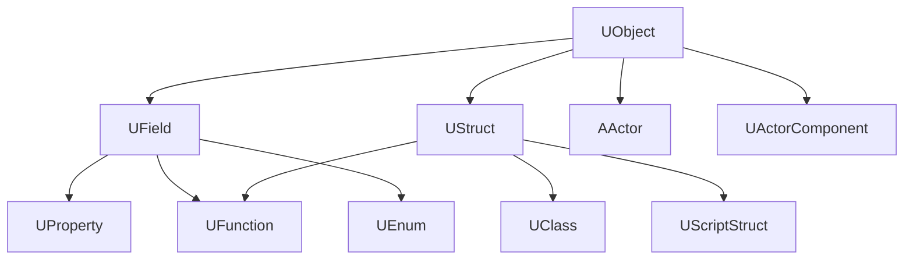
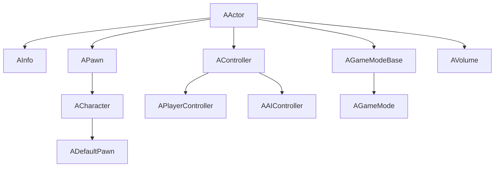
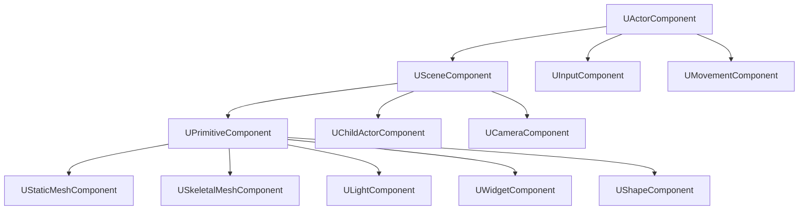
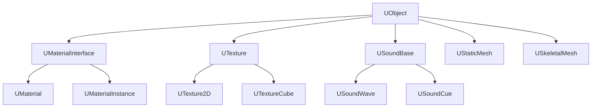
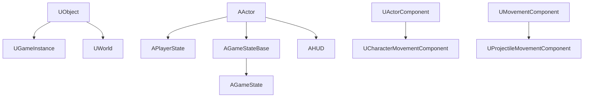
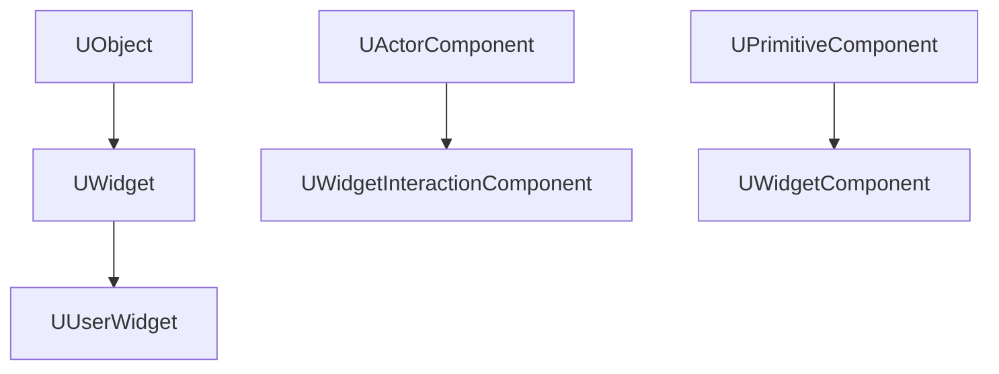
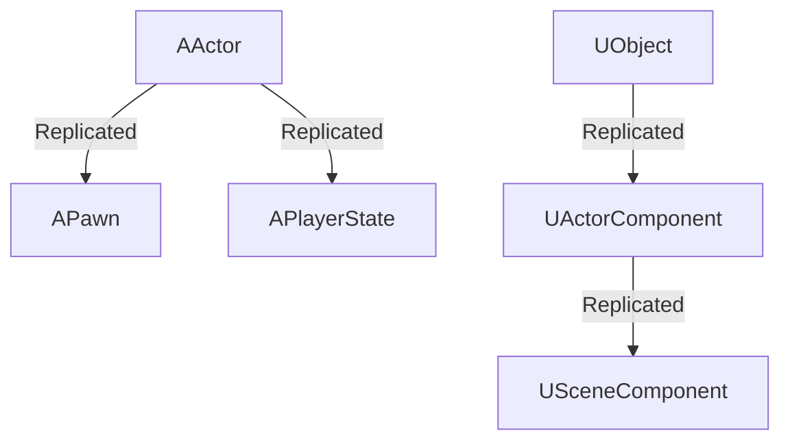
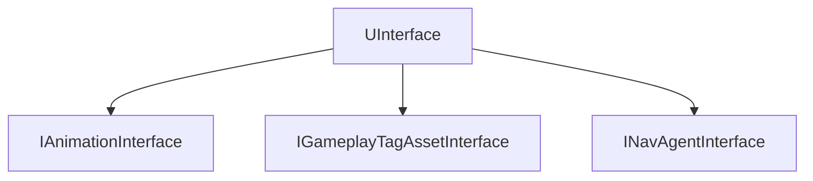
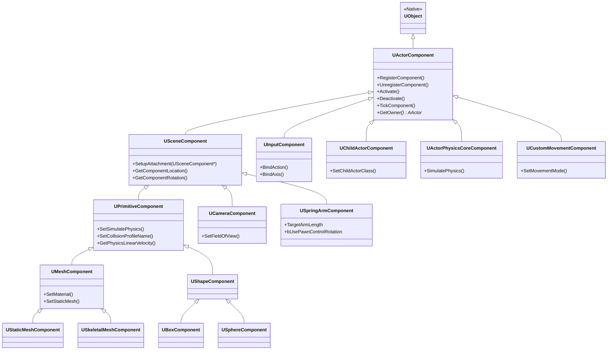

# 零、需求备忘

- 地形扫描生成高度图，高度图导入UE，然后绘制地形
- 三维扫描建模建图，由点云数据生成模型
- 

# 一、初始

## 1.1、快捷键

| 键位                                 | 操作                                      |
| ------------------------------------ | ----------------------------------------- |
| 游戏内E，或游戏外E                   | 上升                                      |
| 游戏内C                              | 下降                                      |
| shift+F1                             | 显示鼠标                                  |
| shift+ESC                            | 退出游戏                                  |
| ctrl+space                           | 显示content栏                             |
| 鼠标左键按住，然后上下左右           | 水平方向上下左右移动                      |
| 鼠标右键按住，上下左右               | 位置不变，视角变化                        |
| 鼠标两建按住或者中间按住，上下左右   | 竖直方向上下左右                          |
| 鼠标左键或者右键按住，wasd           | 控制移动                                  |
| 鼠标按住一个键，然后按Z或C，最后松手 | 临时缩放                                  |
| 侧视图，鼠标中键                     | 测距离                                    |
| 选中物体，ctrl+E                     | 打开模型详细信息                          |
| alt+C                                | 显示碰撞                                  |
| alt+P                                | 游玩                                      |
| 选中物体，shift+E                    | 选中所有基于该物体static_mesh的变换的模型 |
| **蓝图：**                           |                                           |
| 选中，C                              | 添加注释                                  |
| 1，2，3，4+鼠标左键                  | 添加常量                                  |
| 长按鼠标右键                         | 移动蓝图                                  |
| U+鼠标左键                           | 建立UV坐标系                              |
| alt+鼠标左键                         | 取消连线                                  |
| ctrl+alt+F11                         | 热重载                                    |
| F8                                   | 控制器是否控制                            |
|                                      |                                           |
|                                      |                                           |

## 1.2、控制台cmd

| cmd            | 作用         |
| -------------- | ------------ |
| slomo 0.1      | 倍速至0.1    |
| show collision | 展示碰撞体积 |
|                |              |


# 二、地形

## 2.1、光源的区别

在虚幻引擎中，光源的 **Static**、**Stationary** 和 **Movable** 三种模式直接决定了**光照计算方式**、**实时性能消耗**和**动态交互能力**，是优化数字孪生场景的关键设置。以下是深度对比：

------

### **核心区别总结表**

|     **特性**      |      **Static（静态）**      |      **Stationary（静止）**      |     **Movable（可移动）**      |
| :---------------: | :--------------------------: | :------------------------------: | :----------------------------: |
|   **光照计算**    |    完全烘焙（Lightmass）     | 静态部分烘焙 + 动态物体实时阴影  |          完全实时计算          |
|   **性能消耗**    |    ⭐极低（无运行时计算）     |              ⭐⭐中等              |            ⭐⭐⭐极高             |
| **能否移动/旋转** |             ❌ 否             |  ❌ 位置/旋转固定（仅参数可调）   |              ✅ 是              |
| **动态物体投影**  |         ❌ 无动态阴影         |  ✅ 有（通过静态阴影+动态叠加）   |      ✅ 有（完全实时阴影）      |
|   **适用场景**    | 永不移动的物体（建筑、山脉） | 固定光源但需影响动态物体（路灯） | 移动光源（车灯、无人机探照灯） |

## 2.2、天空五要素

在虚幻引擎中构建真实天空环境时，**天空五要素**（Directional Light、Sky Light、Sky Atmosphere、Sky Sphere、Exponential Height Fog）共同协作模拟地球大气散射、光照反射和天气效果。以下是深度解析其作用与联动机制：

------

**核心五要素功能表**

|          **组件**          |                      **核心作用**                       |          **动态控制关键参数**           |       **数字孪生应用场景**       |
| :------------------------: | :-----------------------------------------------------: | :-------------------------------------: | :------------------------------: |
|   **Directional Light**    |         模拟太阳/月亮平行光，主导场景主阴影方向         |   `Rotation`（时间变化）、`Intensity`   |      无人机昼夜巡检光照切换      |
|       **Sky Light**        |       捕获天空环境光（漫反射），提供全局间接照明        | `Source Type`（动态捕获）、`Intensity`  |      车间金属设备的环境反射      |
|     **Sky Atmosphere**     | 物理模拟大气散射（瑞利/米氏散射），实现日出日落色彩渐变 | `Rayleigh Scattering`、`Mie Scattering` |   模拟雾霾天对无人机视觉的影响   |
|       **Sky Sphere**       |     动态天空球体（云层、星空），驱动视觉化天空表现      |    `Cloud Speed`、`Stars Brightness`    |  暴雨/多云天气的无人机飞行仿真   |
| **Exponential Height Fog** |       基于高度的体积雾，模拟空气透视与能见度衰减        |   `Fog Density`、`Fog Height Falloff`   | 无人车在浓雾环境中的激光雷达仿真 |

## 2.3、地形

# 三、C++编程

## 3.1、TEXT和FString

```c++
UE_LOG(LogTemp, Warning, TEXT("Item Tick called!%.4f"),DeltaTime);
FString MyString = FString::Printf(TEXT("Item Tick called!%.4f"), DeltaTime);//Text转Fstring
GEngine->AddOnScreenDebugMessage(-1, 5.f, FColor::Red, MyString);//标签为-1，为默认，同样是-1的文字不会覆盖

FString name = GetName();
UE_LOG(LogTemp, Warning, TEXT("Item Name: %s"), *name);//FString转Text
```

## 3.2、添加移动和旋转

`AddActorWorldOffset` 和 `AddActorLocalOffset`,前者按照世界的xyz移动，后者按照自己的xyz移动。

`AddActorRotation` 和 `AddActorRelativeRotation`也是类似，不过很少对世界进行旋转。

## 3.3、参数暴露给蓝图

|          **类别**          |          **参数**          |                      **应用场景与说明**                      |
| :------------------------: | :------------------------: | :----------------------------------------------------------: |
| **编辑器可见性与可编辑性** |       `EditAnywhere`       | **任意编辑**：在类默认对象（CDO）和实例的编辑器属性窗口中均可编辑。 |
|                            |     `EditDefaultsOnly`     | **仅默认值编辑**：仅在CDO中可编辑，实例中隐藏或只读。适合配置通用默认值。 |
|                            |     `EditInstanceOnly`     | **仅实例编辑**：仅在实例属性窗口中可编辑，CDO中隐藏或只读。适合为特定实例定制参数。 |
|                            |     `VisibleAnywhere`      |     **任意可见**：在CDO和实例中显示为只读（不可编辑）。      |
|                            |   `VisibleInstanceOnly`    |      **仅实例可见**：仅在实例中显示为只读，CDO中隐藏。       |
|                            |     `AdvancedDisplay`      | **高级显示**（元数据）：属性在编辑器详情面板中被折叠，需展开查看。 |
|      **蓝图访问权限**      |    `BlueprintReadOnly`     |          **蓝图只读**：蓝图可获取值，**不可修改**。          |
|                            |    `BlueprintReadWrite`    |      **蓝图读写**：蓝图可读写（需谨慎控制并发与逻辑）。      |
|                            |     `BlueprintSetter`      | **自定义Setter**（元数据）：设置属性时调用指定函数（如`meta=(BlueprintSetter="OnHealthChanged")`）。 |
|                            |     `BlueprintGetter`      | **自定义Getter**（元数据）：获取属性时调用指定函数（如计算值）。 |
|        **网络复制**        |        `Replicated`        | **自动复制**：属性值从服务器同步到客户端（需在`GetLifetimeReplicatedProps`实现）。 |
|                            |     `ReplicatedUsing`      | **带回调的复制**：同步时触发函数（如`ReplicatedUsing="OnRep_Health"`）。 |
|     **序列化与持久化**     |         `SaveGame`         |       **存档支持**：属性值随`SaveGame`对象保存/加载。        |
|                            |        `Transient`         | **临时属性**：不保存到磁盘，重置时恢复默认值（常用于运行缓存）。 |
|                            |   `TextExportTransient`    |             **导出忽略**：文本导出时跳过此属性。             |
|     **内存与引用管理**     |        `Instanced`         |  **自动实例化**：属性引用的对象由其所有者创建（如子组件）。  |
|                            | `NonPIEDuplicateTransient` |         **非PIE忽略**：在编辑器非PIE复制时跳过属性。         |
|      **编辑器元数据**      |         `Category`         |       **分类**（元数据）：属性分组（如`Category="AI”）       |
|                            |       `DisplayName`        | **显示名**（元数据）：覆盖属性名称（如`DisplayName="最大生命值"`）。 |
|                            |         `ToolTip`          |         **提示文本**（元数据）：悬停显示的说明文字。         |
|                            |  `ClampMin` / `ClampMax`   | **数值范围**（元数据）：编辑器输入值约束（如`ClampMin=0.0`）。 |
|                            |     `UIMin` / `UIMax`      |  **UI范围提示**（元数据）：滑块控件建议范围（不强制约束）。  |
|                            |          `Units`           |     **单位**（元数据）：数值显示单位（如`Units="cm"`）。     |
|                            |      `ExposeOnSpawn`       | **生成暴露**（元数据）：在生成节点（如`Spawn Actor`）中显示为可设参数。 |

**EditAnywhere**和**BlueReadWrite**的区别在于，前者主要负责细节面板，后者负责事件蓝图的参数，可以两个都写，方便一点点。前者最好每一个属性都写（也可以换成visibleAnywhere），后者按照需要吧。

## 3.4、函数暴露给蓝图

**BlueprintCallable和BlueprintPure的区别**

| 特性           | `BlueprintCallable`                                          | `BlueprintPure`                                              |
| :------------- | :----------------------------------------------------------- | :----------------------------------------------------------- |
| **核心优势**   | **执行副作用操作：** 能改变状态、控制流程、执行关键操作。    | **无副作用：** 安全、可预测、更容易理解和测试。              |
|                | **控制流程：** 明确控制执行顺序（`Exec` 引脚连接）。         | **数据流驱动：** 无需连线执行流，简化图形（无 `Exec` 线）。  |
|                |                                                              | **可嵌入性：** 能直接插在数据引脚上，减少节点数，提高蓝图可读性。 |
|                |                                                              | **性能潜力（有时）：** 引擎可能对相同输入缓存结果进行优化（虽然UE当前版本不一定总是实现） |
| **主要劣势**   | **执行引脚依赖：** 需要连接执行流，可能使蓝图显得更“乱”。    | **不能做副作用操作：** 受功能限制。                          |
|                | **复杂度：** 包含副作用增加理解和测试的复杂度。              | **执行时机不确定：** 何时被调用由引擎决定（依赖数据流需求），你可能不知道它被调用了多少次（特别是在数据变化快的地方）。 |
|                | **不便嵌入：** 不能直接嵌入到另一个节点的输入引脚里（除特殊节点如`Sequence`的输出引脚）。 | **依赖状态延迟：** 它依赖的数据状态（尤其复制属性）可能不总是最新的，因为它可能在任何帧的任何时间被调用（非同步）。 |
| **何时使用？** | 函数**需要**改变对象状态、影响世界、执行有序操作或有任何副作用。 | 函数**只进行查询/计算**，不改变对象或全局状态。              |
| **使用建议**   | **优先使用 Pure。** 能 Pure 就 Pure！把改变状态（副作用）的操作集中在必要的 `Callable` 函数中。这是一种良好的函数式编程实践，提高代码模块性和可维护性。 | **坚持无副作用原则。** 即使在 C++ 内部实现中也要严格遵守 Pure 的语义（只读，不变性）。错误地在 Pure 函数中写副作用会导致蓝图难以调试的奇怪行为。 |
| **性能注意**   | 调用次数直接由蓝图逻辑控制。                                 | 理论上因为无副作用且幂等，引擎可以做缓存优化（`const`ness 提示）。**但需注意：** 计算如果非常昂贵（例如复杂的遍历或物理查询），尽量避免在 `Pure` 中做，因为它可能被频繁调用。改用 `Callable` + 缓存更可控。 |
| **调试注意**   | 执行点清晰（执行引脚连接处有断点概念）。                     | 断点效果不如 `Callable` 明确（除非引擎内部支持纯函数断点）。 |

**关键规则总结：**

1. **禁止标记构造函数**：任何构造函数都不能使用UFUNCTION
2. **引擎生命周期函数不需标记**：`BeginPlay()`、`Tick()`、`Destroyed()`等由引擎管理
3. **字符串必须正确闭合**：所有字符串参数必须有匹配的引号
4. **避免过度暴露**：只暴露需要蓝图控制的函数
5. **虚函数处理**：
   - 重写虚函数保持`override`关键字
   - 需要蓝图重写时使用`BlueprintNativeEvent`
   - 需要蓝图调用父类实现时使用`BlueprintCallable`

## 3.5、Forward Declaration前向声明

用于提前声明标识符（如类、函数或模板）的存在而不提供其完整定义。它允许你在不完全了解类型细节的情况下引用该类型。

```cpp
class MyClass;  // 类的前向声明
void MyFunction();  // 函数的前向声明
```

### 1、使用场景示例：

头文件中包含前向声明，cpp文件中包含完整定义（对应的`.h`头文件）。

#### 场景1：类指针/引用参数

```cpp
// File: Widget.h
class Gadget; // 前向声明（不需要包含Gadget.h）

class Widget {
public:
    void UseGadget(Gadget* gadget); // 使用前向声明的指针
    
private:
    Gadget* m_gadget; // 成员指针
};
```

#### 场景2：解决循环依赖

```cpp
// File: A.h
#pragma once
class B; // 前向声明B

class A {
public:
    void ProcessB(B* b);
};

// File: B.h
#pragma once
class A; // 前向声明A

class B {
public:
    void ProcessA(A* a);
};
```

#### 场景3：函数返回类型

```cpp
// File: Factory.h
class Product; // 前向声明

class Factory {
public:
    Product* CreateProduct(); // 返回前向声明类型的指针
};
```

### 2、不可使用的场景：

以下情况必须提供完整定义：

```cpp
class IncompleteClass;

// 1. 创建对象实例
IncompleteClass obj; // 错误！需要完整定义

// 2. 访问类成员
obj.MemberFunction(); // 错误！

// 3. 使用sizeof
sizeof(IncompleteClass); // 错误！

// 4. 继承/基类
class Derived : public IncompleteClass {}; // 错误！
```

## 3.6、接口类

UInterface是用来让这个接口参与UE的反射系统（不需要定义），IInterface是用来让别的类继承的类（需要给出各种定义）。

**接口只做声明，不做定义**，所以一般cpp文件是空的

## 3.7、AActor 与 UActorComponent 的核心区别

|   **特性**   | **AActor (Actor)** | **UActorComponent (Actor组件)** |
| :----------: | :----------------: | :-----------------------------: |
|   **本质**   |  场景中的独立实体  |      附加到Actor的功能模块      |
| **存在形式** |  可直接放置到关卡  |       必须依附于Actor存在       |
| **生命周期** |   独立创建/销毁    |     依赖所属Actor的生命周期     |
|   **功能**   |   容器+基础逻辑    |   特定功能实现（物理/渲染等）   |
|   **关系**   |     "汽车"整体     |     "发动机""方向盘"等部件      |
|   **继承**   | `UObject → AActor` |   `UObject → UActorComponent`   |
| **坐标系统** | 有自己的Transform  |         无独立坐标系统          |

**核心差异定位**：Actor 是场景中**可见、可交互的对象实体**，而 ActorComponent 是**扩展Actor功能的模块化部件**。

## 3.8、Debug的方法

推荐USceneComponent的方法

## 3.9、Pawn的输入控制

如果关卡中没有蓝图的auto posses player项目被设置为play0，那么在PIE模式中，会默认生成一个球作为play0，球会随着控制器移动。

如果我有一个pawn，比如说小鸟，当我把它设置成play0的时候，由于没有配置轴映射（axis maping），就是输入控制，那么当我按下按钮的时候，小鸟和视角并不会动，因为小鸟根本不知道我按下按键是什么意思，所以就需要配置按键的回调函数，这样才能控制小鸟飞来飞去。在VS提供的SetupPlayerInputComponent函数中进行配置。

### （1）xyz轴的坐标控制

**step1 在UE/项目设置/引擎/输入这里配置好轴映射**


**step2 配置好moveForward、moveRight函数**

需要用到UFloatMoveComponrent这个组件，需要包含头文件

```cpp
#include "Components/InputComponent.h"
#include "GameFramework/Controller.h"
#include "GameFramework/FloatingPawnMovement.h"

PawnMoveComponent = CreateDefaultSubobject<UFloatingPawnMovement >(TEXT("PawnMover"));
PawnMoveComponent->MaxSpeed = 1200.f;
PawnMoveComponent->Acceleration = 4000.f;
PawnMoveComponent->Deceleration = 8000.f;
PawnMoveComponent->UpdatedComponent=GetRootComponent();

void AMyPawn::MoveRight(float Value)
{
	if (Controller && PawnMoveComponent &&Value != 0.0f)
	{
		AddMovementInput(GetActorRightVector(), Value);
		//AddActorWorldOffset(GetActorRightVector() * Value * 100.0f, true);
	}
}
```

**step3 绑定好回调函数**

```cpp
PlayerInputComponent->BindAxis(FName("Move Forward / Backward"), this, &AMyPawn::MoveForward);
PlayerInputComponent->BindAxis(FName("Move Right / Left"), this, &AMyPawn::MoveRight);
```

### （2）控制器角度变化

#### ① 蓝图做法

**step1 在UE/项目设置/引擎/输入这里配置好轴映射**

**step2 事件蓝图中绑定好控制器偏移**


**step3 pawn蓝图配置物体跟随控制器偏移**


#### ②  C++做法

**step1 在UE/项目设置/引擎/输入这里配置好轴映射**

**step2 配置好lookUp函数**

```cpp
void AMyPawn::LookUp(float Value)
{
	if (Controller &&Value != 0.0f)
	{
		AddControllerPitchInput(Value);
	}
}
```

**step3 绑定好回调函数**

```cpp
PlayerInputComponent->BindAxis(FName("Look Up / Down Mouse"), this, &AMyPawn::LookUp);
PlayerInputComponent->BindAxis(FName("Turn Right / Left Mouse"), this, &AMyPawn::Turn);
```

**step4 配置物体跟随控制器偏移**

```cpp
//在pawn()初始化函数中
bUseControllerRotationPitch = true;// 允许控制器旋转Pitch
bUseControllerRotationYaw = true;// 如果需要同时控制Yaw
bUseControllerRotationRoll = false; // 通常不需要
```

### （3）控制器偏移

如上面所说，可以配置蓝图整体跟随控制器偏移，但是这个方法在控制character的时候就不太合适，所以可以取消蓝图整体跟随控制器偏移，并且让摄像头单独跟随控制器偏移，这样更好。

但是这样的话，还需要解决控制器镜头偏移的时候，pawn和character的wasd移动问题。主要的问题就是解决在镜头偏移的情况下，你的ForwardVector和RightVector是什么样的，此时控制器有个旋转矩阵，通过旋转矩阵就可以得知变化后的新的ForwardVector和RightVector。

```cpp
void AMyCharacter::MoveForward(float Value)
{
	if (Controller  && Value != 0.0f)
	{
		const FRotator ControlRotation = Controller->GetControlRotation();
		const FRotator YawRotation(0, ControlRotation.Yaw, 0);
		const FVector ForwardVector = FRotationMatrix(ControlRotation).GetScaledAxis(EAxis::X);
		AddMovementInput(ForwardVector, Value);
		DebugComponent->DB_Msg_Screen(ForwardVector.ToString(), 0.5f);
	}
}

void AMyCharacter::MoveRight(float Value)
{
	if (Controller  && Value != 0.0f)
	{
		const FRotator ControlRotation = Controller->GetControlRotation();
		const FRotator YawRotation(0, ControlRotation.Yaw, 0);
		const FVector RightVector = FRotationMatrix(ControlRotation).GetScaledAxis(EAxis::Y);
		AddMovementInput(RightVector, Value);
		DebugComponent->DB_Msg_Screen(RightVector.ToString(), 0.5f);
	}
}
```

然后需要勾选这个，才能够让转向更丝滑。注意，勾选这个和上面的新的ForwardVector和RightVector代码，要么同时存在，要么同时不存在，不然就一定会有Bug。


## 3.10、UE的常见类继承关系

### 🧱 核心基类 (Object System)


### 🎬 Actor 系统 (Scene Objects)


### ⚙️ 组件系统 (Components)


### 🎨 资源系统 (Assets)


### 🎮 游戏框架 (Game Framework)


### 🖥️ UI 系统


### 🌐 网络复制 (Replication)


### 🔄 接口系统


## 3.11 添加一个新的模块

比如说，添加一个头发模块`HairStrandsCore`，做法是：

1. 在build.cs文件中添加这个模块
2. 关闭UE，`ctrl+shift+B`重新编译C++文件
3. 删除Binaries、Itermediate、Saved这三个文件夹，然后再次生成C++文件

## 3.12 如何理解UE委托

### 1、如何理解

有一个USphereComponent重叠的例子，这个是用委托实现的。

```cpp
//PrimitiveComponent.h文件里面
DECLARE_DYNAMIC_MULTICAST_SPARSE_DELEGATE_SixParams(
    FComponentBeginOverlapSignature,  // 生成的代理类型名称
    UPrimitiveComponent,             // 拥有此代理的类
    OnComponentBeginOverlap,         // 代理成员变量名
    UPrimitiveComponent*, OverlappedComponent, // 参数1
    AActor*, OtherActor,             // 参数2
    UPrimitiveComponent*, OtherComp, // 参数3
    int32, OtherBodyIndex,           // 参数4
    bool, bFromSweep,                // 参数5
    const FHitResult&, SweepResult   // 参数6
);
```

这个代码是一个宏，每个参数携带关键碰撞信息：

1. **OverlappedComponent**：触发事件的物理组件
2. **OtherActor**：发生碰撞的另一个Actor
3. **OtherComp**：碰撞对象的物理组件
4. **OtherBodyIndex**：碰撞对象的Body ID（复杂物理对象）
5. **bFromSweep**：是否来自扫描式移动（有轨迹的移动）
6. **SweepResult**：碰撞详细信息（位置/法线等）

这个委托是系统自带的，当我需要这个的时候，我可以绑定这个委托，当这个委托发生时（即发生重叠事件），这个重叠事件的相关信息会作为参数发送给各个回调函数，绑定这个委托的个体会执行一次回调函数。

### 2、如何使用

如果一个Item需要有一个重叠回调函数，那么可以这样做。

UFUNCTION以及函数声明->函数实现->回调绑定

```cpp
//在.h文件里
UPROPERTY(VisibleAnywhere, BlueprintReadOnly, Category = "MyCollision")
USphereComponent* CollisionSphere;//设置碰撞球

UFUNCTION()//只有这样才能让UE系统发现
void MySphereOverlapBegin(UPrimitiveComponent* OverlappedComponent, AActor* OtherActor, 
	UPrimitiveComponent* OtherComp, int32 OtherBodyIndex, bool bFromSweep, const FHitResult& SweepResult);

//在.cpp文件里
CollisionSphere = CreateDefaultSubobject<USphereComponent>("CollisionSphere");
CollisionSphere->SetupAttachment(GetRootComponent());

void AItem::BeginPlay()
{
	Super::BeginPlay();
	CollisionSphere->OnComponentBeginOverlap.AddDynamic(this, &AItem::MySphereOverlapBegin);//绑定回调函数
}

void AItem::MySphereOverlapBegin(UPrimitiveComponent* OverlappedComponent, AActor* OtherActor, 
	UPrimitiveComponent* OtherComp, int32 OtherBodyIndex, bool bFromSweep, const FHitResult& SweepResult)
{
	//你的代码逻辑
}
```

这样就完成了，在Item的蓝图实例里面，也可以通过事件图表调用OnComponentBeginOverlap事件进行调试。

**注意：碰撞球的碰撞属性一般不需要特别设置，一般默认在游戏中隐藏，调试时可以关掉**

**注意2：角色一次性生成两次及以上重叠事件，一般是因为多个组件都与Item实例发生重叠，比如capsule组件和角色mesh组件**

## 3.13 动画蓝图的自动规则

如图，指向的条件是一个空的条件。


细节面板勾选了自动规则。


自动处理动画连续性，一般不使用，一般使用数据驱动。

## 3.14 动画蓝图的状态别名

**注意：状态别名只能在子状态机中使用**

本质就是好几种状态放在一起，这几个状态可能会导致一样的结果，给他们这个小团体起个名字就是状态别名。

如图所示，ToFalling这个状态别名可以代表Locomotion和Land两种状态。


ToLand这个状态别名可以代表Jump和Fall Loop这两个状态。


## 3.15 动画蒙太奇的使用

### 1、初步

首先是在**动画->动画蒙太奇**创建，然后在里面加入几个动作，比如说**Attack1**、**Attack2**、**Attack3**，动画蒙太奇默认是按照顺序播放序列动作，也可以通过分段让其播放固定的片段动作。


然后在动画蓝图中添加一个默认的**slot**，然后在**项目设置->引擎->输入**中添加action maping，然后在角色的蓝图中，设置，点击的时候，触发攻击的动作。


用C++实现的步骤：将下面函数绑定到攻击即可。

```cpp
void AMyCharacter::AttackMontagePlay()
{
	UAnimInstance* AnimInstance = GetMesh()->GetAnimInstance();
	if (AttackMontage && AnimInstance)
	{
		AnimInstance->Montage_Play(AttackMontage);
		uint8 Section = FMath::RandRange(0, 2);
		FName SectionName=FName();
		switch (Section)
		{
		case 0:
			SectionName = FName("Attack1");
			break;
		case 1:	
			SectionName = FName("Attack2");
			break;
		case 2:
			SectionName = FName("Attack3");
			break;
		default:
			break;
		}
		AnimInstance->Montage_JumpToSection(SectionName, AttackMontage);
	}	

```

**存在的问题：**

- [ ] 播放时可以移动
- [ ] 攻击会被自己打断

### 2、优化

添加CanAttack的判断。在Attack的时候，把状态设置为Attack，在蒙太奇动画里面，在动画结束的地方靠前一点点，添加一个通知AttackEnd，**注意，动画蓝图里面可以直接搜索到这个通知，但是普通的角色蓝图无法搜索到，**在动画蓝图的事件图表中，把状态设置为UnOccupied。

```cpp
void AMyCharacter::Attack()
{
	if (CanAttack())
	{
		CharacterAction = ECharacterAction::ECA_Attack;
		PlayAttackMontage();
	}
}	
```


或者

**注意，AnimInstance的参数一般都是只读的，他负责单向跟踪Character的信息，但是AnimInstance本身的参数变更是影响不到Character的。**

## 3.16 声音的播放

### 1、声音wave文件

我可以直接在蒙太奇动画序列中添加通知，编辑通知细节可以选择资产。


声音资产可以选择源声音的wave文件，**缺点是，当你想倍速播放，你只能修改原声音资产**

### 2、SoundCue文件

也可以选择声音的**SoundCue**文件，可以解决上面的缺点，也可以单独编辑音高音量等。


### 3、MetaSound文件

优点，自由度更高，更加程序化。

先加入一个输入，一般是你要播放的音频，然后编辑细节信息。


接着是蓝图编辑，


如果输入不是一个wave资产，而是一个数组的wave资产，可以通过shuffle来筛选一个传递到输入。

下面设置声音衰减


## 3.17 碰撞C++设置

```cpp
WeaponBox->SetCollisionEnabled(ECollisionEnabled::QueryOnly);
WeaponBox->SetCollisionObjectType(ECollisionChannel::ECC_WorldDynamic);
WeaponBox->SetCollisionResponseToAllChannels(ECollisionResponse::ECR_Overlap);
WeaponBox->SetCollisionResponseToChannel(ECollisionChannel::ECC_Visibility, ECollisionResponse::ECR_Block);
WeaponBox->SetCollisionResponseToChannel(ECollisionChannel::ECC_Camera, ECollisionResponse::ECR_Ignore);
WeaponBox->SetCollisionResponseToChannel(ECollisionChannel::ECC_Pawn, ECollisionResponse::ECR_Ignore);
```

## 3.18 BoxTrace

### 蓝图


### C++

案例是武器砍物体，进行BoxTrace，当武器的Box触碰到物体时，触发重叠事件，进行检测。

先将Box加入到物理的类中，并且设置碰撞属性。

```cpp
WeaponBox = CreateDefaultSubobject<UBoxComponent>(TEXT("WeaponBox"));
WeaponBox->SetupAttachment(GetRootComponent());
WeaponBox->SetCollisionEnabled(ECollisionEnabled::QueryOnly);
WeaponBox->SetCollisionObjectType(ECollisionChannel::ECC_WorldDynamic);
WeaponBox->SetCollisionResponseToAllChannels(ECollisionResponse::ECR_Overlap);
WeaponBox->SetCollisionResponseToChannel(ECollisionChannel::ECC_Visibility, ECollisionResponse::ECR_Block);
WeaponBox->SetCollisionResponseToChannel(ECollisionChannel::ECC_Camera, ECollisionResponse::ECR_Ignore);
WeaponBox->SetCollisionResponseToChannel(ECollisionChannel::ECC_Pawn, ECollisionResponse::ECR_Ignore);
```

接着设置基本碰撞事件。

```cpp
void AMyWeapon::OnBoxOverlap(UPrimitiveComponent* OverlappedComp, AActor* OtherActor,
	UPrimitiveComponent* OtherComp, int32 OtherBodyIndex, bool bFromSweep, const FHitResult& SweepResult)
{
}
```

然后重写BeginPlay函数，进行事件绑定。将Box的重叠事件绑定到Weapon类的一个函数，这样，当Box发生重叠事件时，就会调用Weapon这个函数。

```cpp
void AMyWeapon::BeginPlay()
{
	Super::BeginPlay();
	if (WeaponBox)
	{
		WeaponBox->OnComponentBeginOverlap.AddDynamic(this, &AMyWeapon::OnBoxOverlap);
	}
}
```

最后补充碰撞事件的细节。函数的使用方法需要搜索，先搜索Ukismetsystemlibrary找到这个库，然后网页内部搜索boxtrace找到相关的函数，根据函数说明找到自己要用的函数。


## 3.19 UActorComponent

继承关系如下



## 3.20 物理约束-角度约束

这里的角度限制和速度，从第一个到最后一个分别是：Roll、Pitch、Yaw。


这里设置速度的单位是RoundPerSecond。


# 四、无人机

FL、BR为顺时针转向，使得无人机有逆时针旋转的趋势。

FR、BL为逆时针转向，使得无人机有顺时针旋转的趋势。

# 五、增强输入系统

## 1、让系统接入增强输入

目录结构如下。


在玩家控制器类里面，只需要添加这个即可，再在Gamemode里面选择自己的玩家控制器类。勾选场景联想最好。


这个代码也可以不用单独的玩家控制器类，也可以直接在你的pawn类的初始化节点中加入，也能实现一样的效果。

如果需要操作的对象不是pawn，而是actor，则需要额外添加这个节点。


## 2、编辑增强输入

目录结构如下。


一个MapContext对应多个IA_XXX。

IA_XXX只需要编辑名字、描述、输出值类型即可，其余的在MapContext中编辑，包括触发器和修改器。


### 1）修改器

只需要考虑这两个。


### 2）触发器


基本触发过程如下：**开始**（按下按键的时候）->**进行中**-> ( **取消**-> ) **触发**->**结束**

**取消**是只有在 **点按**和 **长按**时才需要考虑。

| 触发器     | 功能                                                         | 流程                                                         | 备注                                               |
| ---------- | ------------------------------------------------------------ | ------------------------------------------------------------ | -------------------------------------------------- |
| 下移       | 按键只要是按下的状态，每一帧都会触发                         | 开始->触发s->结束                                            | 只有输入超出阈值才会执行从开始的过程，中间没有进行 |
| 已按下     | 按键按下并且离开，只会触发一次，不论按下的状态停留多久。（如果是手柄，那就需要考虑阈值，如果摇杆输入始终达不到阈值，最后摇杆归零，那么也不会触发，也根本不会开始） | 开始->触发->结束                                             | 只有输入超出阈值才会执行从开始的过程，中间没有进行 |
| 已松开     | 按键超出阈值，执行**开始**以及**进行s**，当我松开导致按键低于阈值，系统认为已退出，执行**触发**和**结束** | 开始->进行s->触发->结束                                      |                                                    |
| 弦操作     |                                                              |                                                              |                                                    |
| 点按       | 当我按键超出阈值时，执行**开始**，并且同时执行**进行s**，当我停留时间超出**点按时间阈值**时，系统认为此次操作不是点按，执行**取消**。如果停留时间没有超出阈值，我就松手导致按键低于触发阈值，系统认为执行了点按操作，执行**触发**以及**结束**。 | 开始->进行s->取消<br />开始->进行s->触发->结束               |                                                    |
| 组合       |                                                              |                                                              |                                                    |
| 脉冲       | 这个稍微复杂，详细的设置如下。开始时触发，意味当按键超出阈值时，执行**开始**的时候，是否选择**触发**，如果勾选，则会**触发**一次，然后**进行s**或者**结束**，否则直接执行**进行s**。间隔，当我按键按下并且停留，则每间隔这段时间会**触发**一次，没到触发我就松开按键，那么会执行**取消**。触发限制，当我执行**触发**的次数刚好等于限制的时候，在这次**触发**之后，立即执行**结束**；设置为0时表示不限制。 | 可能流程如下                                                 |                                                    |
| 长按       | 当我按下按键超出阈值时，执行**开始**，以及**进行**，当我停留时间超出长按时间阈值时，系统认为我这次操作属于长按，执行**触发s**，当我按键按下停留时间没有达到**长按时间阈值**时，我就松手，那么会执行取消。**为一次性**，这个参数决定我是每一帧**触发s**，然后松手执行**结束**，还是达到**长按时间阈值**立即执行**触发**并且**结束**。 | 开始->进行s->取消<br />开始->进行s->触发->结束<br />开始->进行s->触发s->结束 |                                                    |
| 长按和松开 | 当我按键按下并且停留时间超过**长按时间阈值**，那么系统认为你要执行这个操作，系统会一直**进行s**，等到你松手的时候，会立即**触发**一次，并且执行**结束**。没有达到**长按时间阈值**就松手，那么会立即**取消**。 | 开始->进行s->取消<br />开始->进行s->触发->取消               |                                                    |

> **脉冲的可能流程**
>
> 
>
> 开始、触发、结束
>
> 开始、触发、进行s、取消
>
> 开始、触发、进行s、触发、结束
>
> 开始、触发、进行s、触发、进行s、【 **触发、进行s、触发、进行s、……、触发、结束**或者  **触发、进行s、触发、进行s、……、触发、进行s、取消**】
>
> 开始、进行s、取消
>
> 开始、进行s、触发、结束
>
> 开始、进行s、触发、进行s、【 **触发、进行s、触发、进行s、……、触发、结束**或者  **触发、进行s、触发、进行s、……、触发、进行s、取消**】

注意：如果**触发**会调用一个TimeLine，那么如果在**结束**之前这个TiemLine没有执行完，会强制停止这个TimeLine，执行**结束**，如果 **结束**里面会调用一个TImeLine2，则不用担心TImeLine2会执行不完全，因为只有当执行完**结束**的全部流程，按键才能进行下一次响应。

注意2：只要按键低于阈值，就是松手了，一般情况下，都会立即触发**结束**，并且停止所有的**触发**，但是和**开始**是异步的，就是**开始**如果调用TImeLine，那么**结束**不会停止**开始**中没有完成的TimeLine，而且**开始**和**触发**也是异步的，**触发**也不会干扰**开始**的TImeLine。

注意3：**开始**是单独的线程，**进行**、**触发**、**结束**是相同的线程，只要按键松开，**结束**立刻干掉**进行**和**触发**，只要**触发**，**触发**也会立刻干掉**进行**。

注意4：**开始**和**结束**只执行一帧，**进行**和**触发**可以执行多帧，执行多帧一般不会有TimeLine，执行一帧的可以有TimeLine，碰巧**开始**和**结束**都能确保执行完成。（取消视作结束）

# 旋转体


可以通过Rotate Vector转变为方向向量。


**旋转方向：**单位是角度

- Yaw：为正向右转，z轴顺时针
- Pitch：为正抬头转
- Roll：

# 六、小技巧备忘

## 1、场景捕获组件拍照


# 七、组件的使用

## 1、场景捕获组件

### 1、拍照


## 2、载具系统


