## 制作骨骼网格体

## 编辑物理资产

编辑PA的图元，所有图元-模拟生成命中事件-勾选，车轮图元-物理类型-运动学

## ChaosVehiclesPlugin插件打开

## 前轮蓝图

   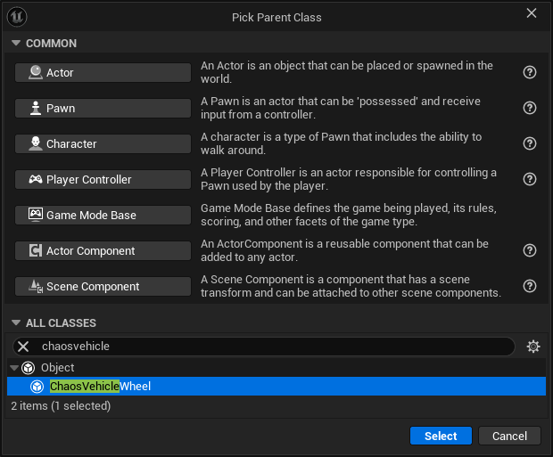

   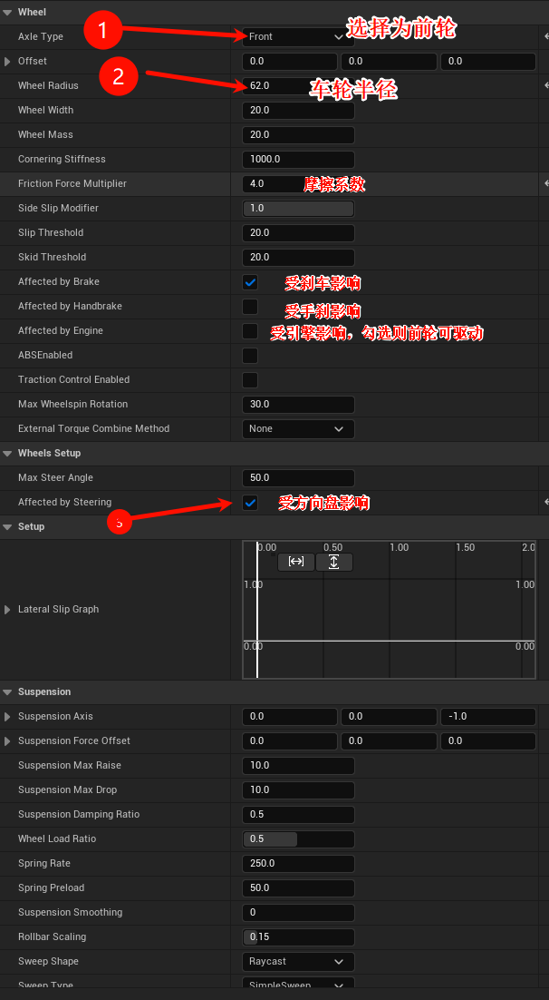

## 后轮蓝图

编译前轮蓝图，复制一个命名为后轮蓝图。修改一些参数。

   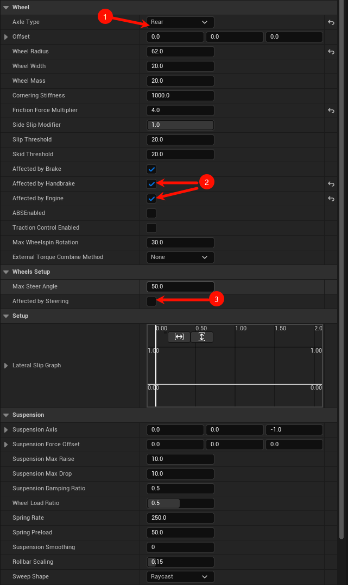

   编译保存。

## 汽车蓝图

   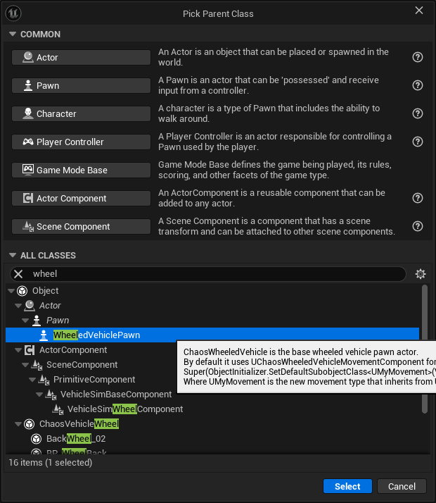

   修改mesh为汽车的skm，添加弹簧臂和相机。可能需要将弹簧臂的offset往上设置，防止车会挡住弹簧臂。

   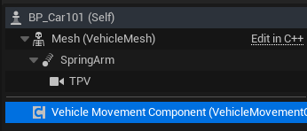

   在汽车运动组件里面添加轮胎。索引0和1选择刚刚创建的前轮蓝图，3和4选择刚刚创建的后轮蓝图。以及需要填写对应轮胎的骨骼名称。

   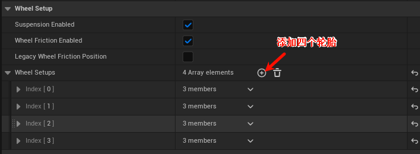

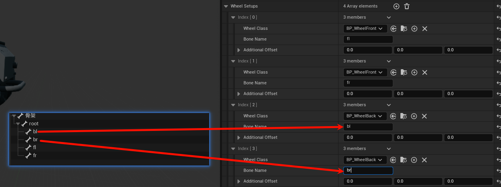

设置引擎参数，主要是扭矩曲线。

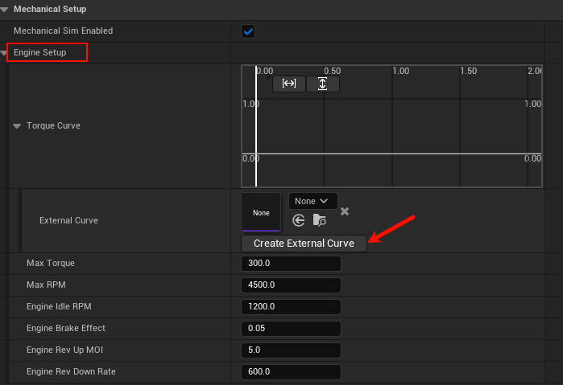

选择创建外部曲线。简单设置一下四个关键点。（0,0.4）（1.2,0.4）（0.3,1）（0.6,0.85）

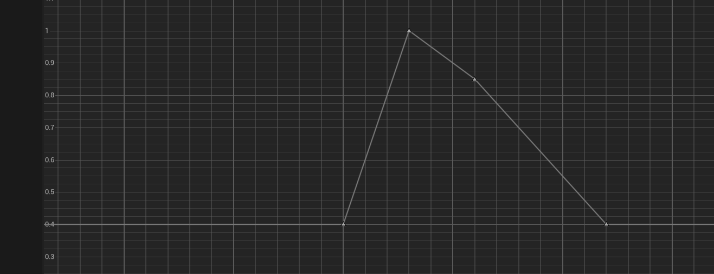

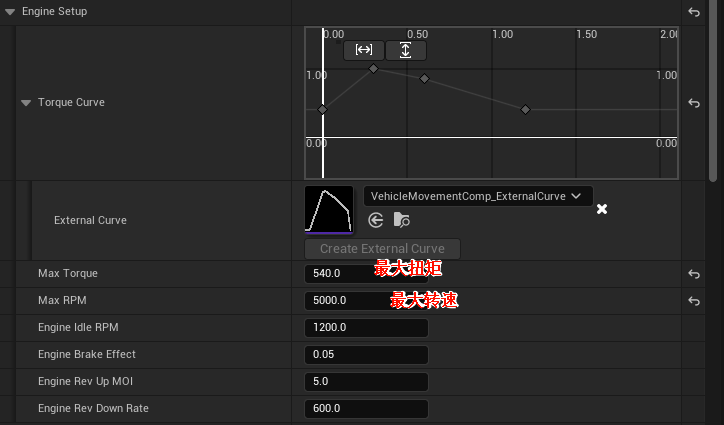

**选择网格体**，然后勾选模拟物理。

## 汽车动画蓝图

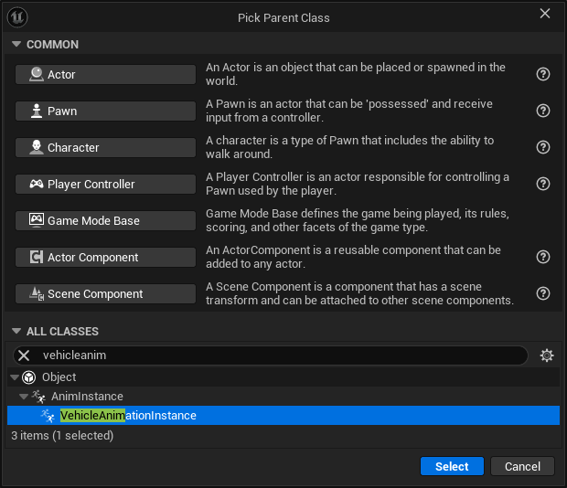

选择好骨骼之后，依次添加两个函数就行。

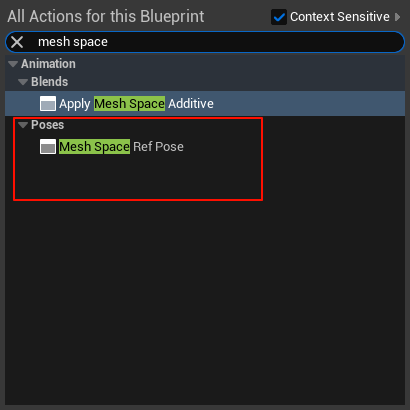

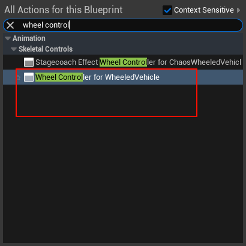

依次连接。

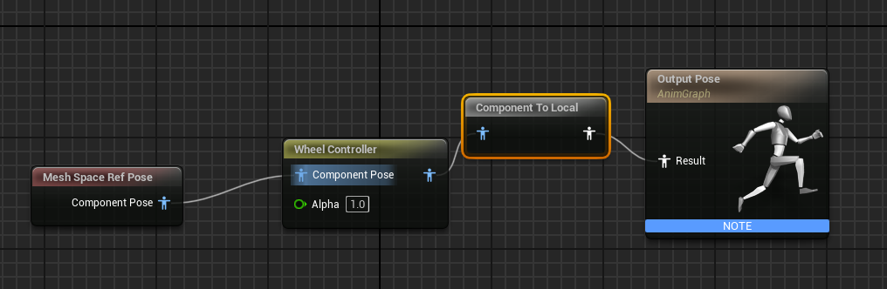

在汽车蓝图里面设置动画蓝图。

## 增强输入设置

### 前设置-设置输入行为

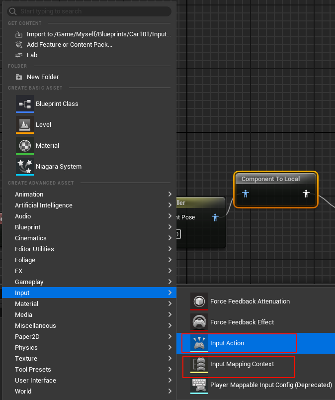

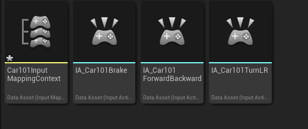

IA控制的主要是输入的数据类型，这里统一设置为float。

输入映射上下文主要管理按键输入和行为的关系。

### 绑定输入

设置汽车蓝图的pawn属性为玩家0，即可被控制。

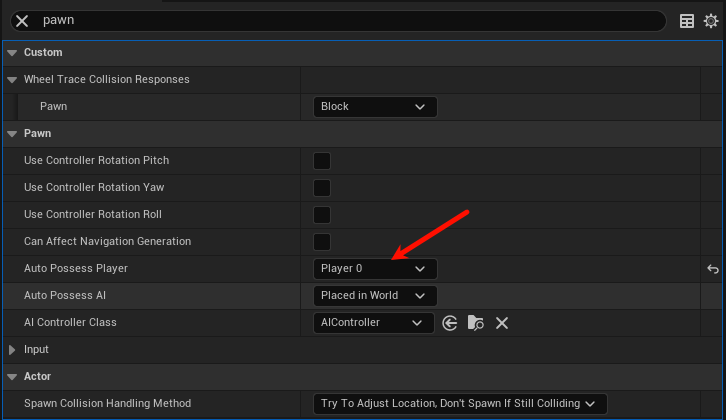

绑定输入。

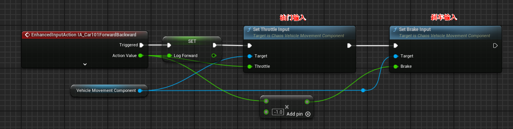

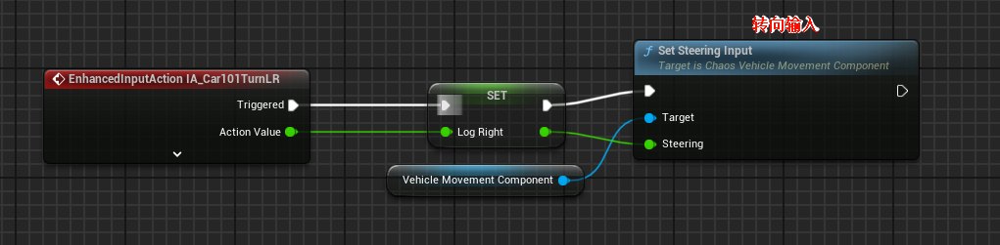

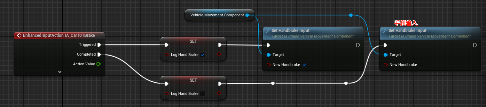

### 后设置-让系统接入增强输入

玩家控制器蓝图。

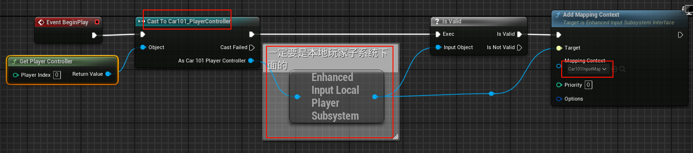

游戏模式蓝图。

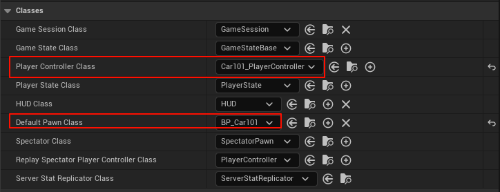

